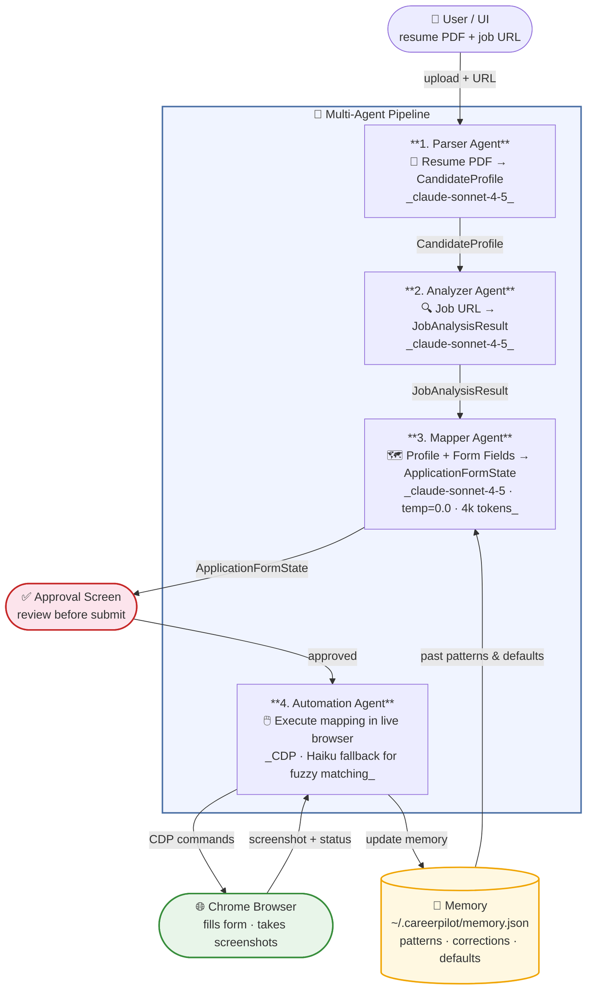

# CareerPilot — AI Job Application Agent

An AI-powered multi-agent system that automatically fills job application forms using your resume and a live browser session.

---

## Quick Start

### Prerequisites

- **Python 3.10+** — [python.org](https://python.org)
- **Node.js 18+** — [nodejs.org](https://nodejs.org) (LTS version)
- **Google Chrome** installed (the agent uses your real browser via CDP)
- An **Anthropic API key** from [console.anthropic.com](https://console.anthropic.com)

---

### 1. Clone and configure

```bash
git clone https://github.com/ajithkumara/careerpilot.git
cd careerpilot
```

Copy the example environment file and fill in your key:

```bash
cp .env.example .env
```

Edit `.env`:

```
ANTHROPIC_API_KEY=sk-ant-api03-xxxxxxxxxxxx
CDP_PORT=9222
PORT=8000
UPLOAD_DIR=uploads
```

---

### 2. Install backend dependencies

```bash
cd backend
python -m venv ../venv
# Windows:
..\venv\Scripts\activate
# Mac/Linux:
source ../venv/bin/activate

pip install -r requirements.txt
```

---

### 3. Install frontend dependencies

```bash
cd ..          # back to project root
npm install
```

---

### 4. Launch Chrome with remote debugging

CareerPilot drives your real Chrome browser (not a headless instance), so Chrome must be started with the remote-debugging port open.

**Option A — let the app do it (recommended):**
Start the backend, then click **"Launch Chrome"** in the UI. The backend will find and launch Chrome automatically.

**Option B — manual launch:**

Windows (PowerShell):
```powershell
& "C:\Program Files\Google\Chrome\Application\chrome.exe" --remote-debugging-port=9222 --user-data-dir="$env:TEMP\chrome-cdp"
```

Mac:
```bash
/Applications/Google\ Chrome.app/Contents/MacOS/Google\ Chrome \
  --remote-debugging-port=9222 \
  --user-data-dir=/tmp/chrome-cdp
```

---

### 5. Start the backend

```bash
# from project root, with venv active
cd backend
uvicorn app.main:app --reload --port 8000
```

You should see:
```
INFO:     Uvicorn running on http://127.0.0.1:8000
```

---

### 6. Start the frontend

Open a second terminal:

```bash
# from project root
npm start
```

Visit **http://localhost:3000** in your browser.

---

### 7. Use the app

1. Upload your PDF resume
2. Paste the job posting URL (Greenhouse, Lever, Workday, LinkedIn, etc.)
3. Click **Analyze & Apply**
4. Review the mapped fields and approve
5. Watch the agent fill the form in your live Chrome window

---

## Architecture — How the Agents Coordinate

CareerPilot uses a **pipeline of four specialized agents**, each with a distinct responsibility. They hand off structured data to each other through Pydantic models, working toward the common goal of submitting one complete job application.



### What each agent does

**Parser Agent** reads the uploaded PDF resume and extracts a `CandidateProfile`: personal details, work history with exact start/end dates, education, skills, and certifications. This runs once per resume upload and the result is reused across multiple applications.

**Analyzer Agent** fetches the job posting URL, identifies the ATS platform (Greenhouse, Lever, Workday, etc.), and extracts `JobAnalysisResult`: job title, required skills, company info, and whether the page will redirect to an ATS.

**Mapper Agent** is the core reasoning layer. It receives the candidate profile, job details, and a list of form fields discovered on the page (with labels, types, and available options), then outputs a complete `ApplicationFormState`: an action for every field (`type`, `select`, `upload`, `skip`) with the exact value to use. It handles EEO/demographic fields, salary fields, behavioral questions, and edge cases like sponsorship and relocation via a structured system prompt with explicit priority rules.

**Automation Agent** executes the mapping against the live Chrome tab via the Chrome DevTools Protocol (CDP). For each field it:
- Resolves the DOM element using multi-strategy lookup (ID → name → CSS selector → label matching)
- For dropdowns: opens the dropdown, navigates with ArrowDown key presses (react-select auto-focuses index 0 on open, so `N` key presses → index `N`), then presses Enter
- Falls back to coordinate-based click if keyboard navigation doesn't close the dropdown
- Falls back to **Claude Haiku** for semantic option matching when string similarity finds no match
- Takes screenshots before and after submission

### Agent coordination model

Agents do not run in parallel — they form a **sequential pipeline** where each stage's output is the next stage's input. The Mapper and Automation agents share the same `ApplicationFormState` object: Mapper populates it with intended values, Automation fills it in the browser and updates `status`, `screenshot_path`, and `error_message`. This means every decision is traceable: you can inspect what the Mapper decided for each field before the Automation agent acts on it (the UI shows the approval screen between these two stages).

---

## How the Agent Learns Over Time

CareerPilot stores a persistent memory file at `~/.careerpilot/memory.json`. This file grows as you complete applications and is included in every Mapper Agent prompt so past experience improves future form-filling accuracy.

### What is remembered

**Demographic defaults** — values used for EEO fields (gender, race, disability status, veteran status, etc.) are stored once and reused. They never change unless you edit `memory.json` directly.

**Field patterns** — after each application, field labels and the values that were successfully submitted are recorded. For example, if `"How did you hear about us?"` was filled with `"LinkedIn"` on five different Greenhouse forms, that association is stored and used as a high-confidence default on the next form.

**Company-specific memory** — answers that worked on a specific ATS or company form are tagged to that source. If you've applied to Workday forms before, the agent knows which option labels are typical for Workday and can pick them faster.

**Correction learning** — if you change a pre-filled value on the approval screen before submitting, the correction is recorded. The agent treats your manual edits as ground truth and favors those values in future forms with similar labels.

### Memory file structure

```json
{
  "demographic": {
    "gender": "Man",
    "race": "Asian",
    "disability": "I do not have a disability",
    "veteran": "I am not a protected veteran"
  },
  "field_patterns": [
    {
      "label_pattern": "how did you hear",
      "value": "LinkedIn",
      "confidence": 0.95,
      "seen_count": 12
    }
  ],
  "corrections": [
    {
      "label": "Years of experience",
      "corrected_value": "8",
      "original_value": "7",
      "timestamp": "2025-09-01T10:22:00Z"
    }
  ]
}
```

The more applications you run, the richer this file becomes, and the fewer fields the Mapper needs to reason from scratch.

---

## Project Structure

```
careerpilot/
├── backend/
│   └── app/
│       ├── agents/
│       │   ├── automation.py   # CDP browser automation + Haiku fallback
│       │   ├── mapper.py       # Form field → value mapping (Sonnet)
│       │   ├── parser.py       # Resume PDF → CandidateProfile
│       │   └── analyzer.py     # Job URL → JobAnalysisResult
│       ├── services/
│       │   ├── browser.py      # CDP session, element discovery, label extraction
│       │   └── memory.py       # Persistent memory read/write
│       ├── models/             # Pydantic schemas
│       ├── api/                # FastAPI routes
│       └── config.py           # Settings (from .env)
├── src/                        # React frontend
├── .env                        # API key and config (never commit this)
├── package.json
└── README.md
```

---

## Troubleshooting

| Problem | Fix |
|---------|-----|
| `Chrome not found` | Set `CHROME_PATH` in `.env` to the full path of `chrome.exe` |
| `CDP connection refused` | Make sure Chrome is running with `--remote-debugging-port=9222` |
| Dropdown selects wrong option | Check the logs for `[SELECT]` — the label/options list shows what the Mapper saw |
| Field filled with wrong text | Open `~/.careerpilot/memory.json` and correct the relevant `field_patterns` entry |
| `Anthropic API error` | Verify `ANTHROPIC_API_KEY` in `.env` has no extra spaces |
| Backend won't start | Make sure the venv is activated (`which python` should point inside `venv/`) |
| Port already in use | Change `PORT=8001` in `.env` and restart |

---

## To stop the servers

Press `Ctrl + C` in each terminal window (backend and frontend separately).
